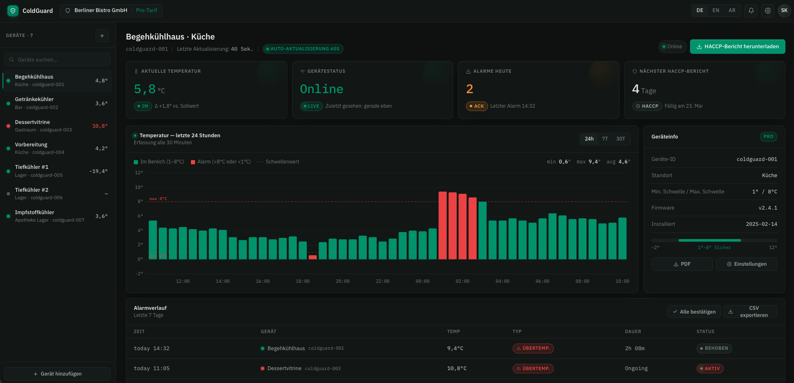

# ColdGuard Frontend

ColdGuard — IoT Temperature Monitoring System  
React Dashboard

## Preview




---

## Requirements

- Node.js 18+
- npm or yarn
- Git

---

## Setup

### 1. Clone Repository
```bash
git clone https://github.com/asaadaskar/Coldguard-Frontend.git
cd Coldguard-Frontend
```

### 2. Install Dependencies
```bash
npm install
```

### 3. Environment Variables
```bash
cp .env.example .env
```
Edit `.env` with your values:
```
VITE_API_BASE_URL=http://localhost:8000
```

### 4. Start Development Server
```bash
npm run dev
```

Open [http://localhost:5173](http://localhost:5173) in your browser.

---

## Build for Production

```bash
npm run build
npm run preview
```

---

## Git Workflow

### Branches
```
KAN-{number}-{short-description}
```
Example: `KAN-15-New-Dashboard`

### Commits
```
[KAN-{number}]: {message}
```
Example: `[KAN-15]: add temperature chart component`

---

## Project Structure

```
Coldguard-Frontend/
├── src/
│   ├── api/
│   │   └── client.js        ← API calls to Django backend
│   ├── components/
│   │   ├── MetricCard.jsx   ← Metric cards (temp, status, alarms, HACCP)
│   │   ├── TempChart.jsx    ← Temperature bar chart
│   │   ├── DeviceLogs.jsx   ← Device error logs panel
│   │   └── Sidebar.jsx      ← Device list sidebar
│   ├── App.jsx              ← Main dashboard
│   └── index.css            ← Global styles & CSS variables
├── public/
├── index.html
├── vite.config.js
└── package.json
```

---

## API Integration

The frontend connects to the Django backend via:

| Method | URL | Description |
|--------|-----|-------------|
| GET | /api/dashboard/current/ | Current temperature & status |
| GET | /api/dashboard/history/ | Temperature history (24h/7d/30d) |
| GET | /api/dashboard/alarms/ | Alarm history |
| GET | /api/logs/ | Device logs (admin & customer) |

---

## Features

- 🌡️ Live temperature monitoring
- 📊 Temperature history chart (24h / 7d / 30d)
- 🔔 Alarm history with duration & status
- 🛠️ Device logs (admin view — technical messages)
- 🌍 Multilingual: DE / EN / AR (with RTL support)
- ⚡ Auto-refresh every 40 seconds
- 📴 Offline/Heartbeat failure detection

---

## Built With

- [React](https://react.dev) — UI Framework
- [Recharts](https://recharts.org) — Chart Library
- [Vite](https://vitejs.dev) — Build Tool